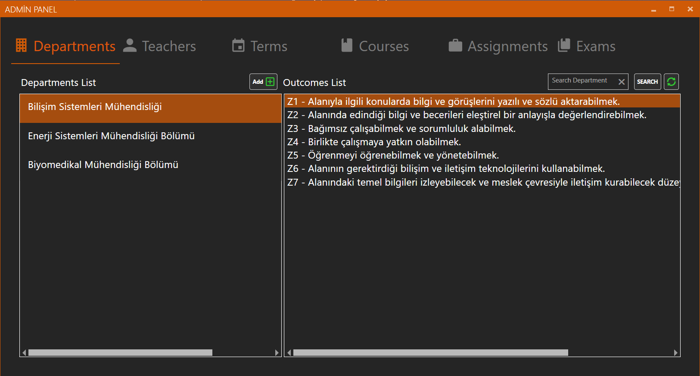
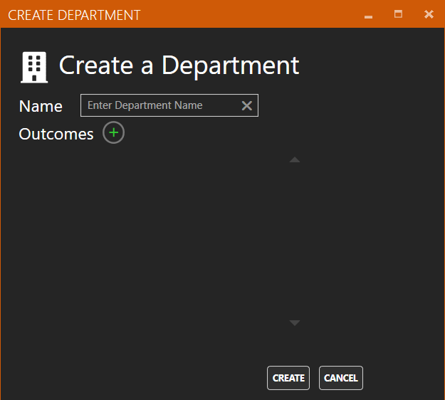
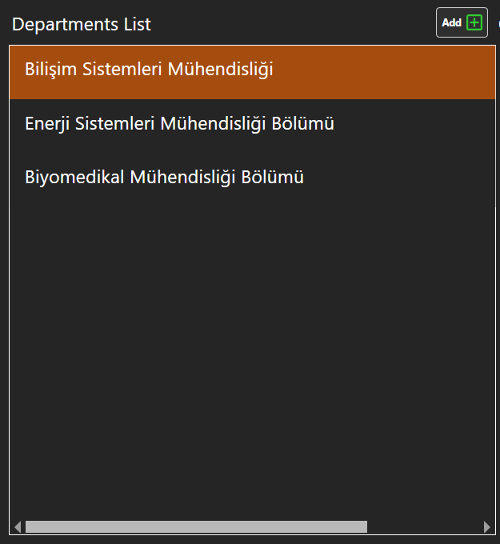
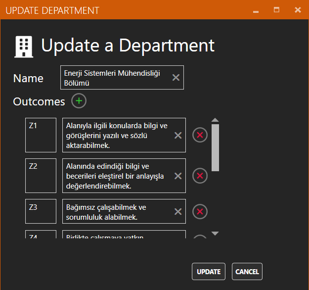
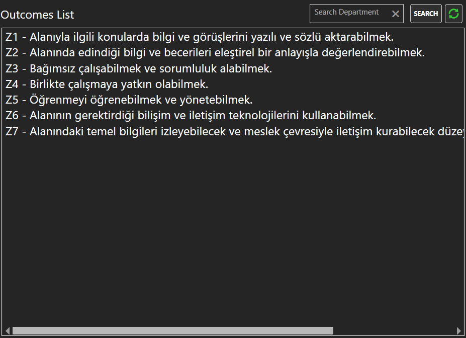

# Departments

### Department Add 

Bölüm ekleme işlemi Department panelinde bulunan “Add” butonu ile gerçekleştirilir. Tıklandığında “Create Department Window” penceresini açar 

### Create Department Window 

“Add” butonuna tıklandıktan sonra karşımıza çıkan ekranda ekleyeceğiniz bölümün adını ve eklemek istediğiniz kadar kazanım sayısını arttırıp kazanım bilgilerini girmeniz gerekmektedir. Ardından “Create” butonuna basarak ekleme işlemi tamamlanır. 

### Search Department 

Aramak istediğiniz bölümü Text Box kısmına yazıp “Search” butonuna bastıktan sonra bölümlerin isimlerine göre, aradığınız bölümler listelenir. 

### Refresh 

Bu butona tıklandıktan sonra veri tabanından verilerin en son hali alınıp eski listeyle değiştirilir. 

### Departments List 

Bölümlerin İsimlerinin listelendiği kısımdır. 

### Update Department 

“Departments List” kısmında listelenen bölümlerin sağ tarafında bulunan ilk buton ile gerçekleştirilir. Tıklandığında seçilen bölümün bilgilerini alarak “Update Departmen Window” penceresini açar. 

### Update Department Window 

Seçilen bölümün bilgilerini gerekli yerlere doldurur. “Update” butonuna bastıktan sonra yaptığınız değişiklikler güncellenir. 

### Department Delete 

“Departments List” kısmında listelenen bölümlerin sağ tarafında bulunan ikinci buton ile gerçekleştirilir. Tıklandığında seçilen departmanı ve kazanımlarını siler. 

### Departments Outcomes List 

Seçilen bölümün kazanımlarının listelendiği kısımdır. 

