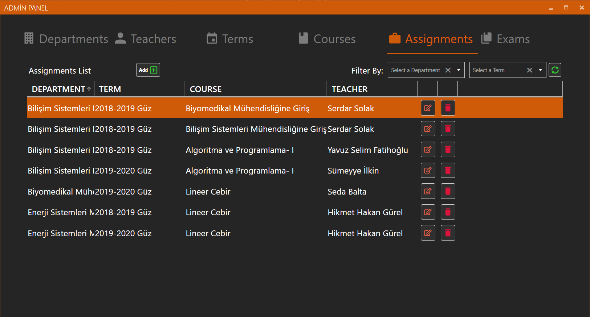
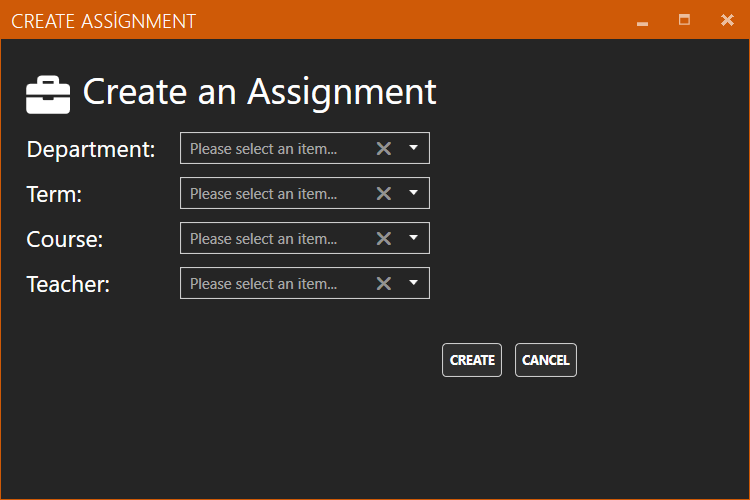
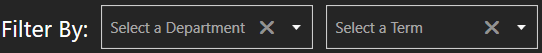
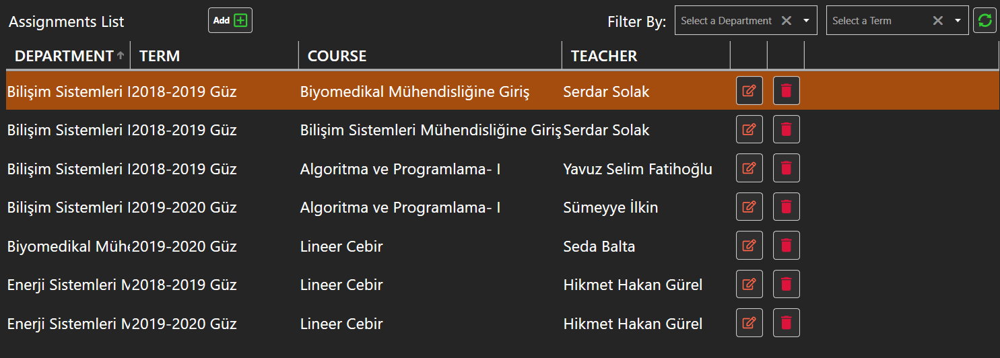
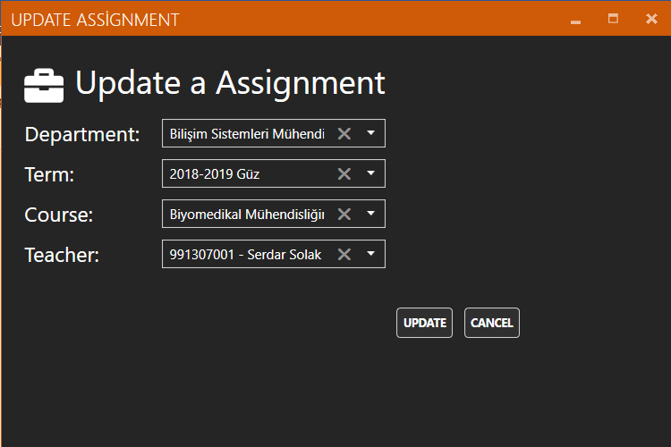

# Assignment

### Assignments Add 

Öğretmeni derse atama işlemi Assignments panelinde bulunan “Add” butonu ile gerçekleştirilir. Tıklandığında “Create Assigment Window” penceresini açar 

### Create Assignment Window 

“Add” butonuna tıklandıktan sonra karşınıza çıkan ekranda ekleyeceğiniz öğretmenin bilgilerini girmeniz gerekmektedir. Seçilecek olan ders, bölüm ve döneme göre listelenmektedir. Son olarak “Create” butonuna basarak ekleme işlemi tamamlanır. 

### Assignment Search 

Aramak istediğiniz atama işlemlerinin bölümünü ve dönemini seçtiğinizde aradığınız atama işlemleri listelenir. 

### Refresh 

Bu butona tıklandıktan sonra veri tabanından verilerin en son hali alınıp eski listeyle değiştirilir. 

### Assignments List 

Atama işlemlerinin listelendiği kısımdır. 

### Update Assignment 

“Assigments List” kısmında listelenen atama işlemlerinin sağ tarafında bulunan ilk buton ile gerçekleştirilir. Tıklandığında seçilen atama işleminin bilgilerini alarak “Update Assigment Window” penceresini açar. 

### Update Assignment Window 

Seçilen atama işleminin bilgilerini gerekli yerlere doldurur. “Update” butonuna bastıktan sonra yaptığınız değişiklikler güncellenir. 

### Assignment Delete 

“Assignment List” kısmında listelenen atanan işlemlerinin sağ tarafında bulunan ikinci buton ile gerçekleştirilir. Tıklandığında seçilen atanan işlemi siler.

