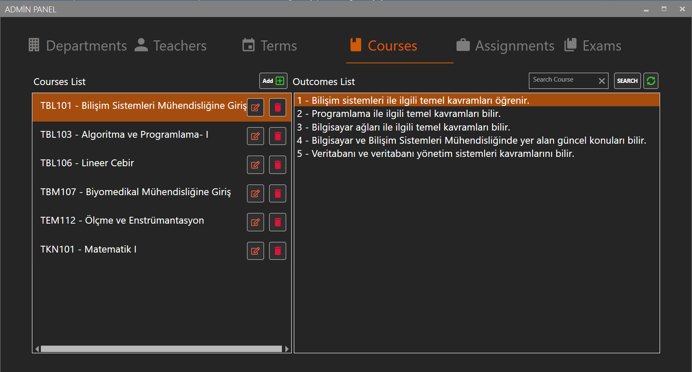
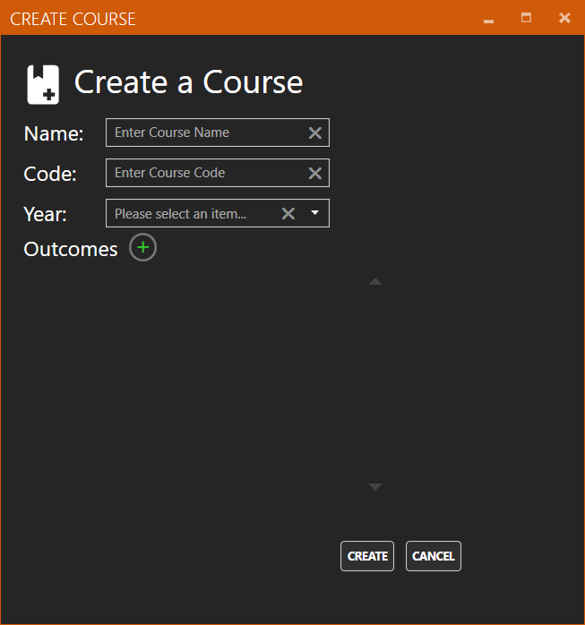
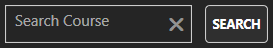
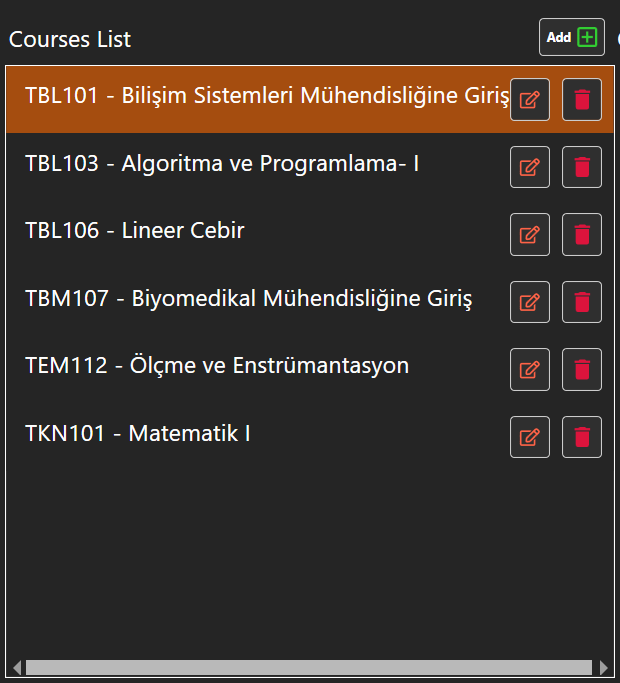
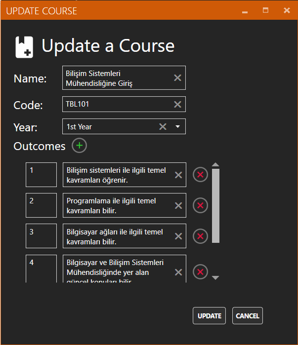
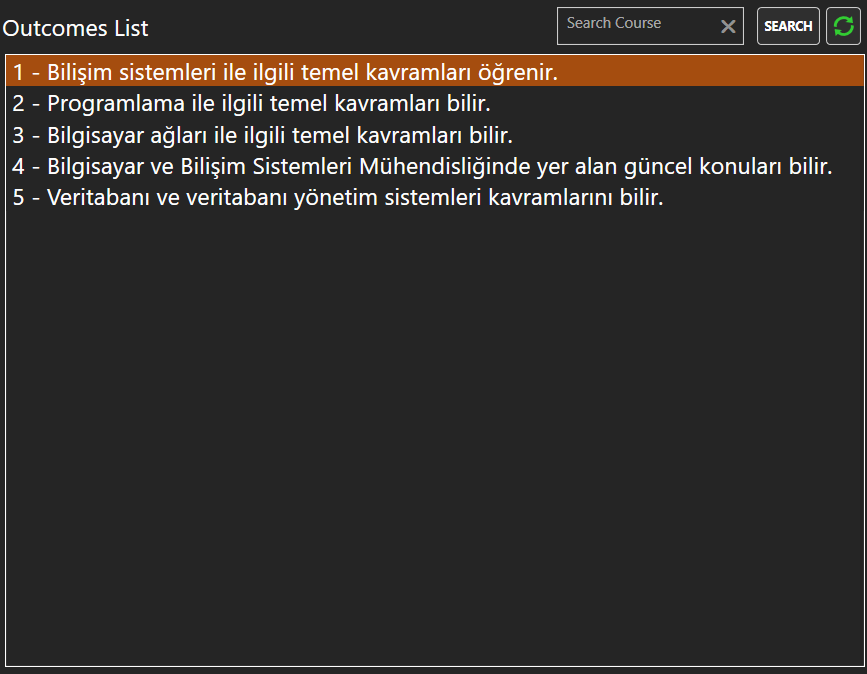

# Courses

### Course Add 

Ders ekleme işlemi Courses panelinde bulunan “Add” butonu ile gerçekleştirilir. Tıklandığında “Create Course Window” penceresini açar 

### Create Course Window 

“Add” butonuna tıklandıktan sonra karşımıza çıkan ekranda ekleyeceğiniz dersin adını, kodunu, ekleyeceğiniz yılı ve eklemek istediğiniz kadar kazanım sayısını arttırıp kazanım bilgilerini girmeniz gerekmektedir. Ardından “Create” butonuna basarak ekleme işlemi tamamlanır. 

### Course Search 

Aramak istediğiniz dersi Text Box kısmına yazıp “Search” butonuna bastıktan sonra derslerin isimlerine göre, aradığınız bölümler listelenir. 

### Refresh 

Bu butona tıklandıktan sonra veri tabanından verilerin en son hali alınıp eski listeyle değiştirilir. 

### Courses List 

Derslerin kodlarının ve İsimlerinin listelendiği kısımdır. 

### Update Course 

“Courses List” kısmında listelenen bölümlerin sağ tarafında bulunan ilk buton ile gerçekleştirilir. Tıklandığında seçilen dersin bilgilerini alarak “Update Course Window” penceresini açar. 

### Course Update Window 

Seçilen dersin bilgilerini gerekli yerlere doldurur. “Update” butonuna bastıktan sonra yaptığınız değişiklikler güncellenir. 

### Course Delete 

“Courses List” kısmında listelenen bölümlerin sağ tarafında bulunan ikinci buton ile gerçekleştirilir. Tıklandığında seçilen dersi ve kazanımlarını siler. 

### Courses Outcomes List 

Seçilen dersin kazanımlarının listelendiği kısımdır. 

