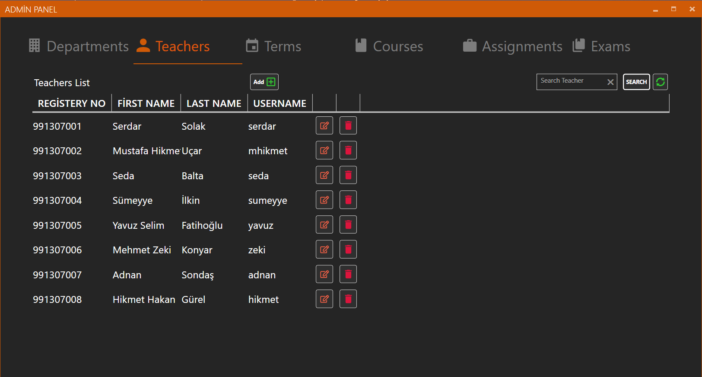
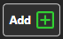
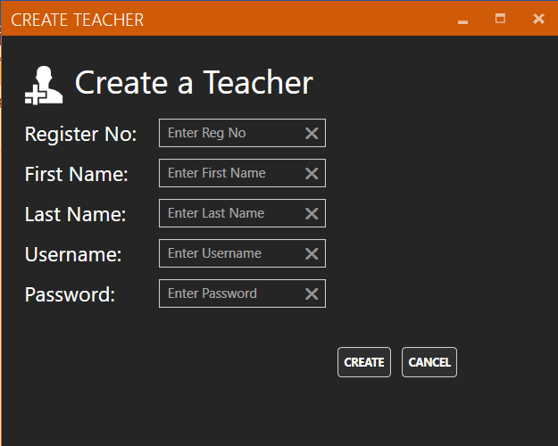
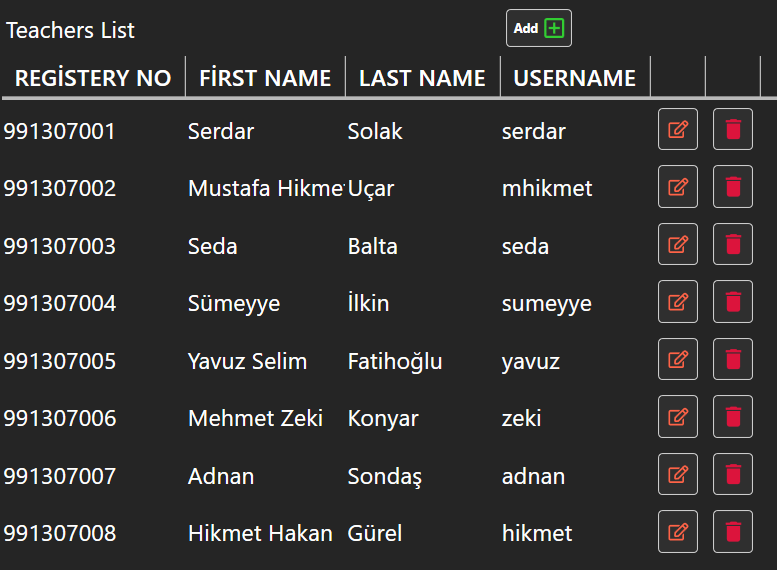
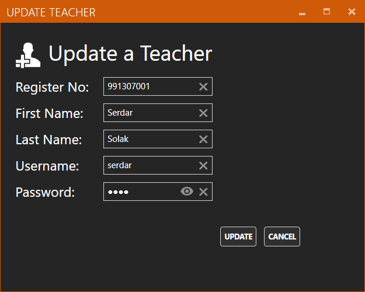

# Teachers

### Teachers Add 

Öğretmen ekleme işlemi Teachers panelinde bulunan “Add” butonu ile gerçekleştirilir. Tıklandığında “Create Teacher Window” penceresini açar 

### Create Teacher Window 

“Add” butonuna tıklandıktan sonra karşımıza çıkan ekranda ekleyeceğiniz öğretmenin bilgilerini girmeniz gerekmektedir. Ardından “Create” butonuna basarak ekleme işlemi tamamlanır. 

### Search Teacher 

Aramak istediğiniz öğretmenin adını Text Box kısmına yazıp “Search” butonuna bastıktan sonra öğretmenlerin isimlerine göre, aradığınız öğretmenler listelenir. 

### Refresh 

Bu butona tıklandıktan sonra veri tabanından verilerin en son hali alınıp eski listeyle değiştirilir. 

### Teachers List 

Öğretmenlerin bilgilerinin listelendiği kısımdır. 

### Update Teacher 

“Teachers List” kısmında listelenen öğretmenlerin sağ tarafında bulunan ilk buton ile gerçekleştirilir. Tıklandığında seçilen öğretmenin bilgilerini alarak “Update Teacher Window” penceresini açar. 

### Update Teacher Window 

Seçilen öğretmenin bilgilerini gerekli yerlere doldurur. “Update” butonuna bastıktan sonra yaptığınız değişiklikler güncellenir. 

### Teacher Delete 

“Teachers List” kısmında listelenen öğretmenlerin sağ tarafında bulunan ikinci buton ile gerçekleştirilir. Tıklandığında seçilen öğretmeni siler. 

