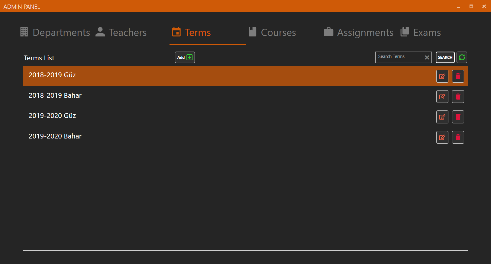
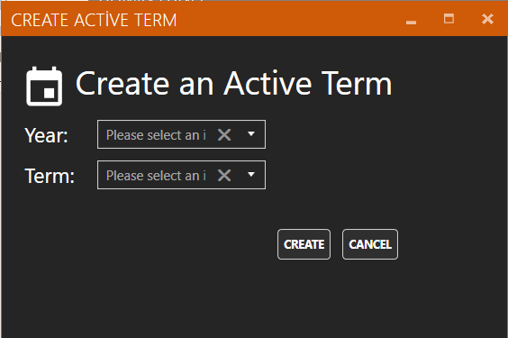
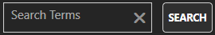
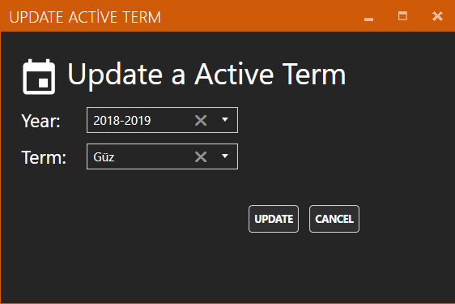

# Terms

### Terms Add 

Dönem ekleme işlemi Terms panelinde bulunan “Add” butonu ile gerçekleştirilir. Tıklandığında “Create Active Term Window” penceresini açar 

### Create Active Term Window 

“Add” butonuna tıklandıktan sonra karşımıza çıkan ekranda ekleyeceğiniz yıl ve dönemin bilgilerini girmeniz gerekmektedir. “Create” butonuna basarak ekleme işlemi tamamlanır. Ayrıca yılların dönemlerini ekledikten sonra tekrardan o yıla aynı dönemi ekleyemezsiniz. 

### Search Terms 

Aramak istediğiniz yılı Text Box kısmına yazıp “Search” butonuna bastıktan sonra yıllarına göre, aradığınız dönemler listelenir. 

### Refresh 

Bu butona tıklandıktan sonra veri tabanından verilerin en son hali alınıp eski listeyle değiştirilir. 3.2.3.4 Terms List Dönemlerin bilgilerinin listelendiği kısımdır. 

### Update Terms 

“Terms List” kısmında listelenen dönemlerin sağ tarafında bulunan ilk buton ile gerçekleştirilir. Tıklandığında seçilen dönemin bilgilerini alarak “Update Active Term Window” penceresini açar. 

### Update Active Term Window 

Seçilen dönemin bilgilerini gerekli yerlere doldurur. “Update” butonuna bastıktan sonra yaptığınız değişiklikler güncellenir. 

### Term Delete 

“Terms List” kısmında listelenen dönemlerin sağ tarafında bulunan ikinci buton ile gerçekleştirilir. Tıklandığında seçilen dönemi siler. 

