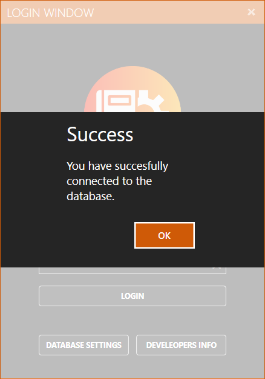
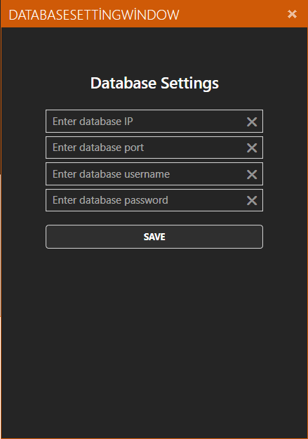
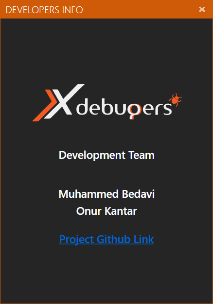
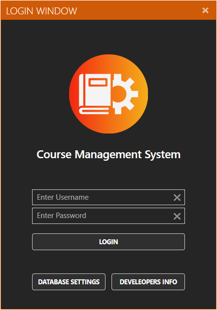

# Login Screen

### Login Ekranı Bağlantı 

Uygulama ilk çalıştığında kendiliğinden veri tabanına bağlantı kurmaya çalışacak. Eğer sorunsuz bir şekilde veri tabanına bağlanırsa onay mesajı gelir eğer bir sorunla karşılaşırsa uyarı mesajı gelir.

### Database Settings 

Bu kısımda manuel olarak bağlanmak istediğiniz veri tabanının bilgilerini girip “Save” butonuna basarsanız seçtiğiniz veri tabanına bağlanır.

### Developer Info

Bu kısımda uygulama geliştiricilerinin bilgileri ve projenin bulunduğu GitHub bağlantısı bulunmaktadır.

### Login 

Veri tabanında bulunan öğretmenin ya da admin’in sahip olduğu kullanıcı adı ve şifreyle uygulamaya giriş yapılan kısımdır.

