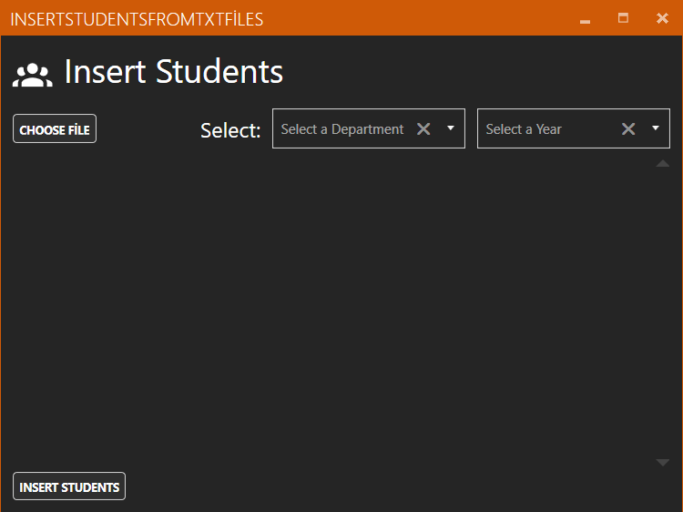
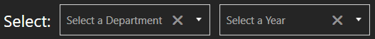
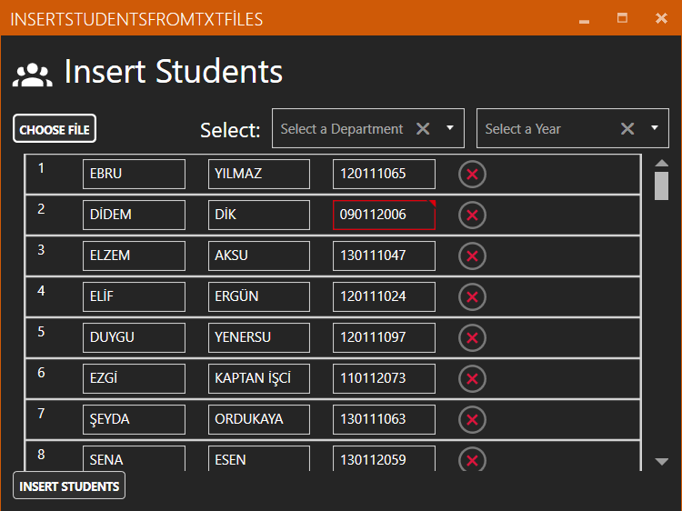
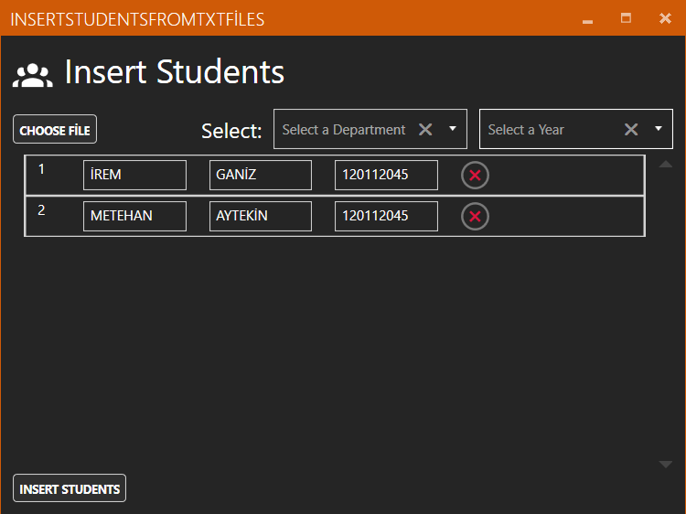
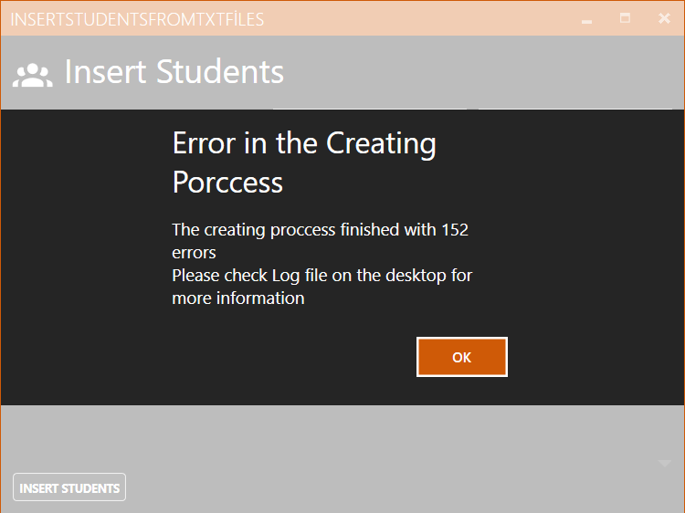
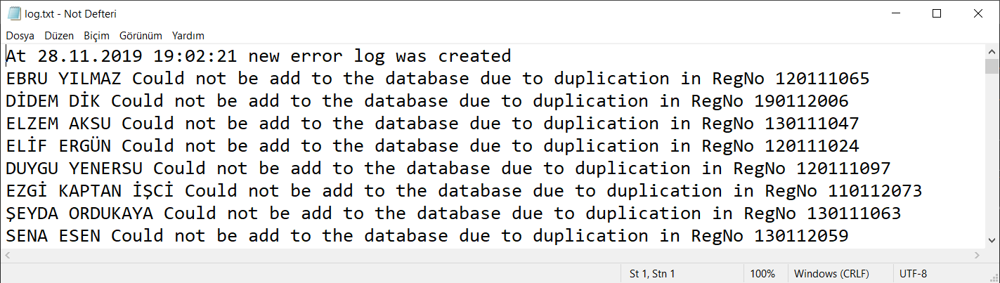

# Insert Students

Veri tabanına öğrenci eklemek için kullanılan butondur. Tıklandığında “Insert Students Window” penceresini açar. 

## Insert Students Window 

Öğrencilerin listesini yükleyip oluşan hataları düzelttikten sonra öğrencileri veri tabanına ekleme kısmıdır. 

### Choose File 

Öğrencilerin listesinin .txt uzantılı dosya aracılığıyla yüklemeyi sağlayan buton. 

### Select Department And Year 

Veri tabanına eklenecek olan öğrencilerinin hangi bölüme ve döneme ekleneceğine seçerek karar verilen kısım. 

### Fixing Students 

Öğrencilerin listesi yüklendikten sonra karşımıza eksik veya yanlış bilgili öğrencilerin kırmızı yandığı bir öğrenci listesi çıkar. Bu kısımda hatalı bilgili öğrencileri düzeltip ya da silip listeyi hatasız hale getirmeniz gerekir. 

### Dublicate RegNo 

Listeyi düzenledikten sonra eğer listede aynı numaraya sahip öğrenciler bulunuyorsa bu öğrencileri düzeltmeniz için tekrardan karşınıza yeni bir liste olarak gelir. 

### Insert Students 

Öğrencilerin veri tabanına eklemek için kullanılan buton.

### Log File 

Eğer eklemek istediğiniz öğrenciler hali hazırda veri tabanında bulunuyorsa program hata verir ve karşılaştığı hataları içeren bir log.txt dosyasını masaüstünüze gönderir. 

### 

