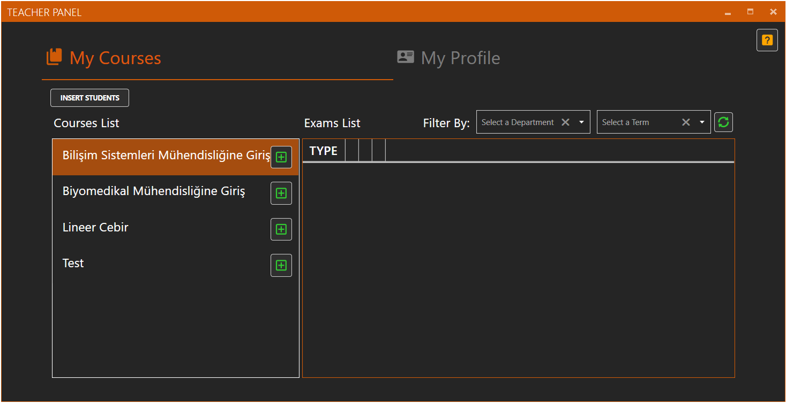
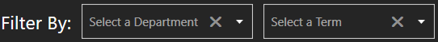
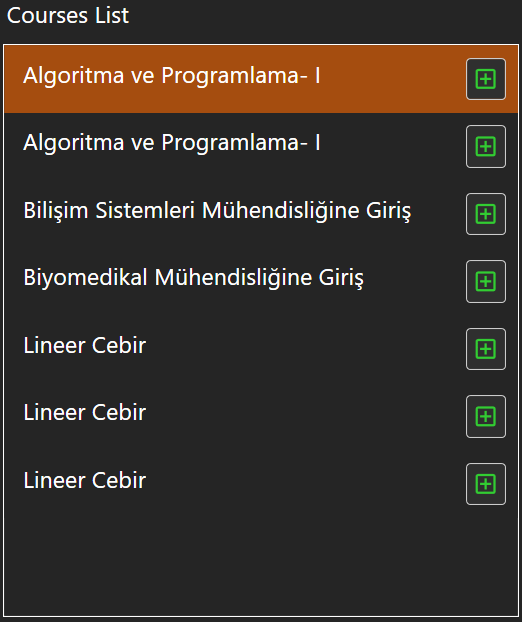
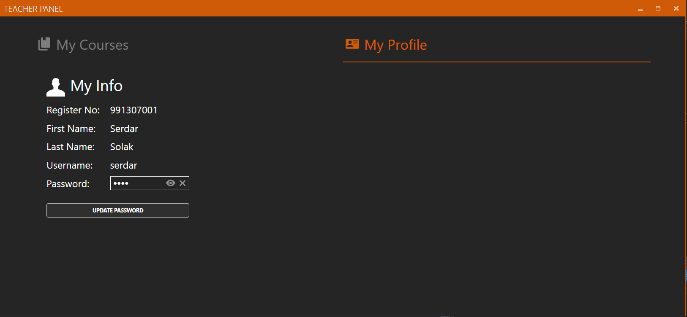

# Teacher Panel

### My Courses 

Bu kısımda öğretmen kendine atanan dersleri görebilir, bu derslere sınav ekleyebilir veya daha önceden gerçekleştirmiş olduğu sınavları listeleyebilir, silebilir, analitik verilerini excel’e aktarabilir veya isterse daha önceden oluşturmuş olduğu excel dosyasını tekrardan görüntüleyebilir. Bu bölümün Admin panelindeki Exam bölümünden farkları: Admin panelinde derslerin hepsinin, öğretmen panelinde ise sadece öğretmene atanan derslerin listeleniyor olması ve öğrenci ekleme kısmının sadece admin panelinde bulunmasıdır. 

###  

### Assignment Search 

Aramak istediğiniz sınavın bölümünü ve dönemini seçtiğinizde aradığınız sınavlar listelenir. 

### Refresh 

Bu butona tıklandıktan sonra veri tabanından verilerin en son hali alınıp eski listeyle değiştirilir. 

### Course List 

Tüm derslerin listelendiği kısım. 

### My Profile 

Öğretmen paneline giriş yapan öğretmenin bilgilerinin bulunduğu kısım.

