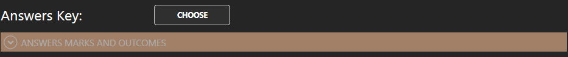

# Exams

## Create Exam 

“Course List” kısmında her dersin yanında bulunan buton ile gerçekleştirilir. Tıklandığında “Create Exam Window” penceresini açar. 

### Create Exam Window 

“Course List” kısmında seçilen derse sınav eklemek için kullanılır. Sınavın tipini, tarihini, cevap anahtarını, cevapların kazanımlarını, cevap puanlarını ve öğrencilerin cevap listesini girerek sınav “Create” butonuna basarak oluşturulur. 

### Exam Type And Date 

Oluşturulacak sınavın türünün ve tarihinin seçildiği kısım.

### Answers Key Choose 

Cevap anahtarının seçildiği kısım. 

### Answers Marks And Outcomes 

Cevap anahtarı seçildikten sonra karşınıza çıkan her grubun ve her sorunun; kazanımlarını ve puanlarını girmeniz için açılan kısım. Verileri girdikten sonra “Save” butonuna basıp kaydetmeniz gerekmektedir. 

### Students Answers List Choose 

Sınava giren öğrencilerin cevap listesinin seçildiği kısım. 

### Fix Students Data Window 

Yüklenen dosyadaki öğrencilerden, veri tabanında bulunmayan öğrenciler karşınıza bir liste olarak çıkar. Bu Listeyi geçebilmeniz için veri tabanından kontrol ederek hatalı verilere sahip öğrencileri düzeltmeniz ya da bu listeden silmeniz gerekmektedir. 

### Dublicate RegNo 

Listeyi düzenledikten sonra eğer listede aynı numaraya sahip öğrenciler bulunuyorsa bu öğrencileri düzeltmeniz için tekrardan karşınıza yeni bir liste olarak gelir. Bu numaraları da veri tabanına bakarak düzeltmelisiniz. 

### Students Answers 

Sınava giren öğrencilerin listesi seçilip tüm hatalar düzeltildikten sonra oluşturulan öğrenci listesinin gösterildiği kısım. 

## Exams List 

Seçilen dersin sınavlarının gösterildiği kısım. 

### Create Excel File 

Seçilen sınavın analitik verilerini bir Excel dosyasına yazdırmak için kullanılan buton. 

### Click To View 

Seçilen sınavın analitik verilerini eğer daha önceden oluşturulmuşsa bu butona tıklayarak o Excel dosyasına ulaşabilirsiniz. Eğer oluşturulmuşsa ve daha sonradan silinmişse bu buton size o dosyası bulamaz ve uyarı mesajı verir. Uyarı mesajına “Ok” cevabını vererek Excel dosyasını tekrardan oluşturabilirsiniz. 

### Delete Exam 

Seçilen sınavı silmek için kullanılan buton. 

## Excel File 

Sınavın analitik verilerini tutan Excel dosyası 3 kısımdan oluşmaktadır. 

### Sayfa1 

Hangi öğrencinin hangi soruyu doğru ya da yanlış yaptığı, öğrencilerin toplam puanları ve soruların bilinme oranları gibi verileri gösterir. 

### Sayfa2 

Sorulardan alınan ortalama puanın ve başarı yüzdesinin gösterildiği kısım. 

### Sayfa3 

Kazanımlardan alınan ortalama puanın ve başarı yüzdesinin gösterildiği kısım. 

### 

